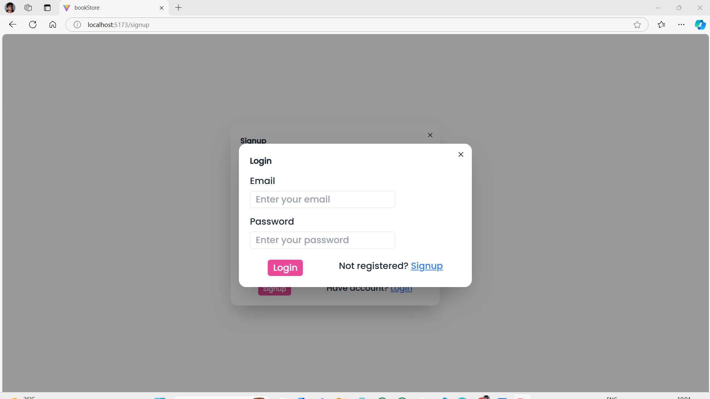
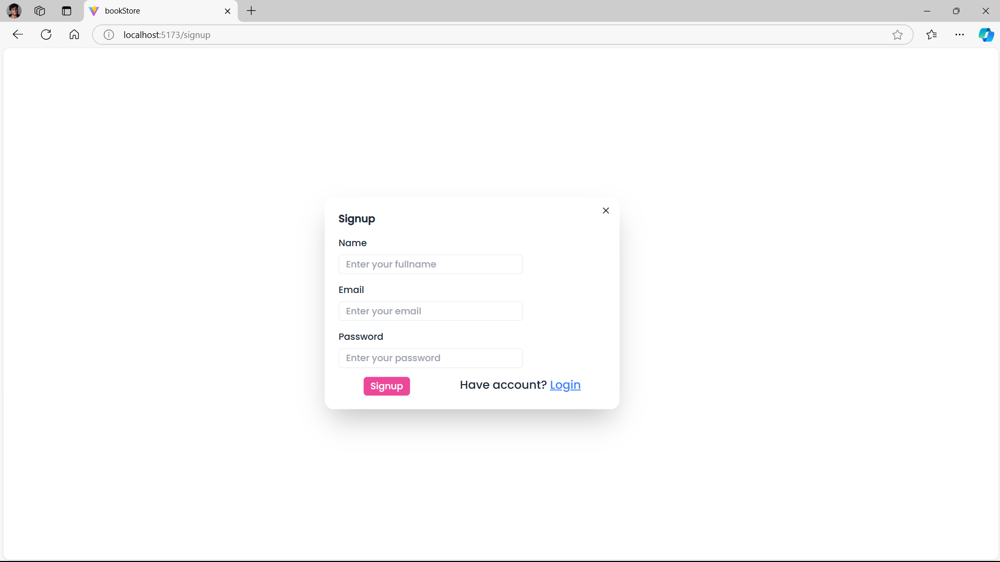
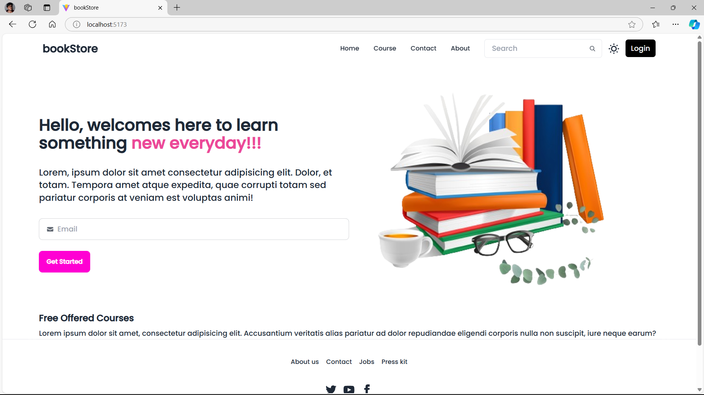
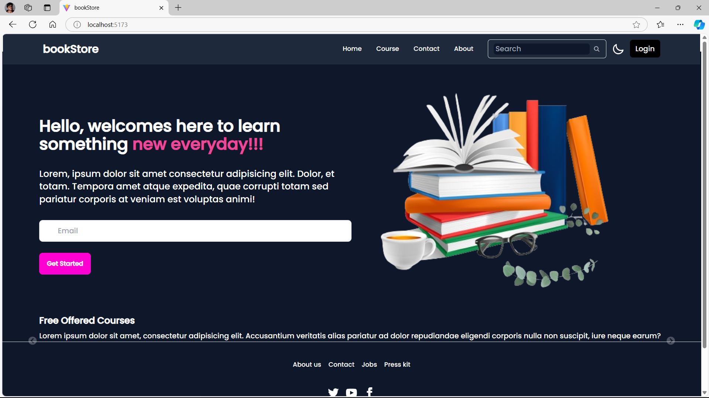

# Book Store App
A Book Store App is platform where users can browse books, view details, add books to a cart, and potentially complete a purchase.

# Screenshots
## Login

## Signup

## home

## Course

## Darkmode

## Description 
Mostly, it is UI base based project.

# Project Structure
## Frontend (React)
I build the user interface of the book store using React for fast, responsive views.

## Backend (Node.js + Express + MongoDB )
If you want to manage books, users, and orders dynamically, you'll need a backend to handle data operations like creating, updating, reading, and deleting (CRUD) books.

## Database
You can use MongoDB (NoSQL) to store book records and potentially user orders.

### How to run 
1) Run the command "node index.js" (Be sure, you are in Backend's path)

2) Run the command "npm run dev" (Be sure, you are in Frontend's path)